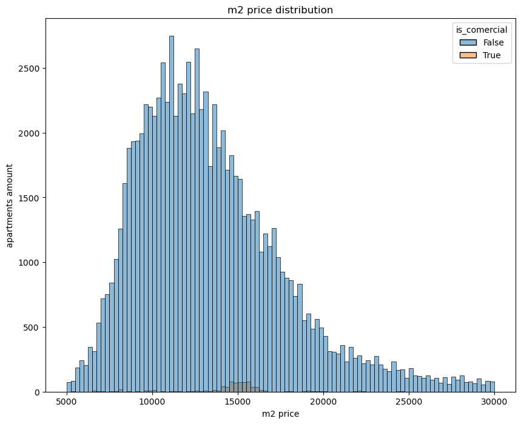
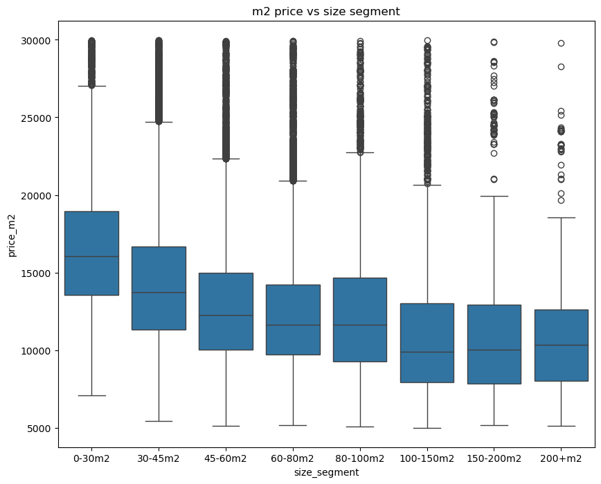
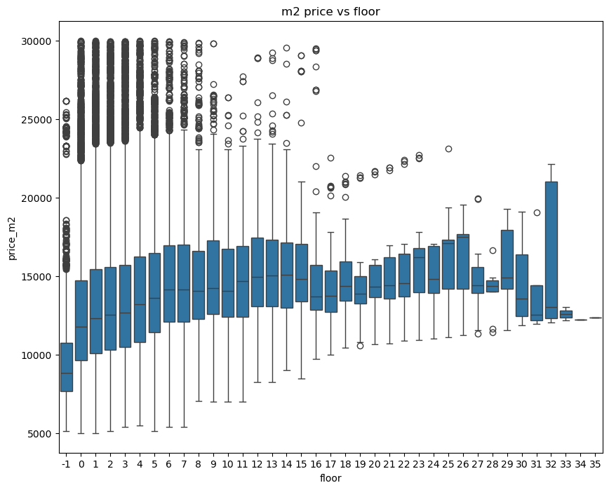
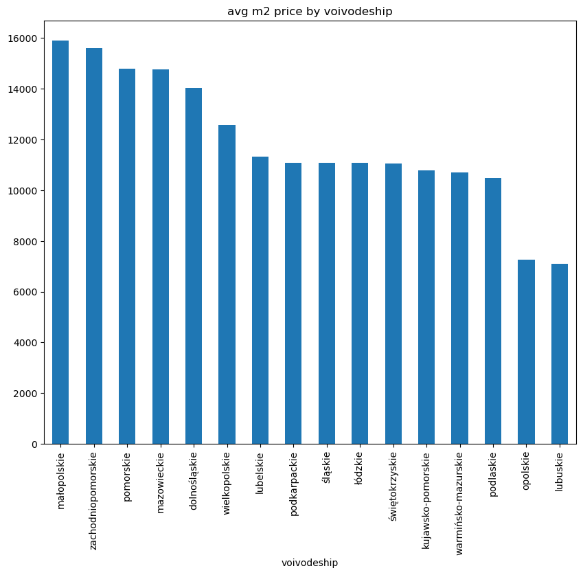
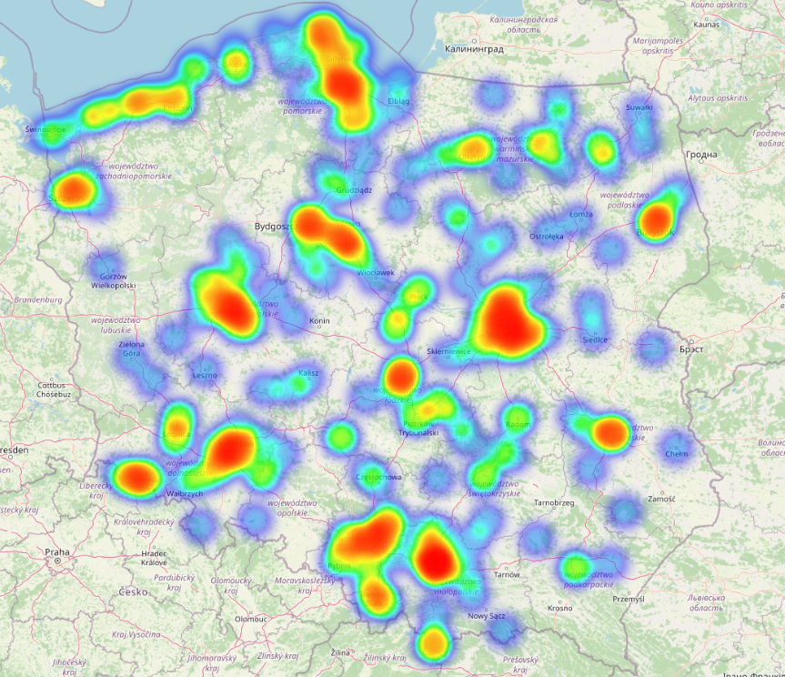
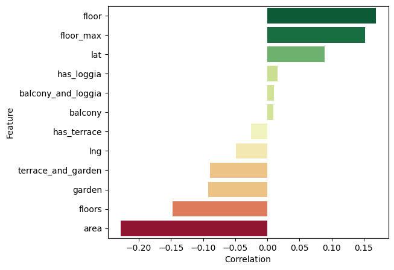
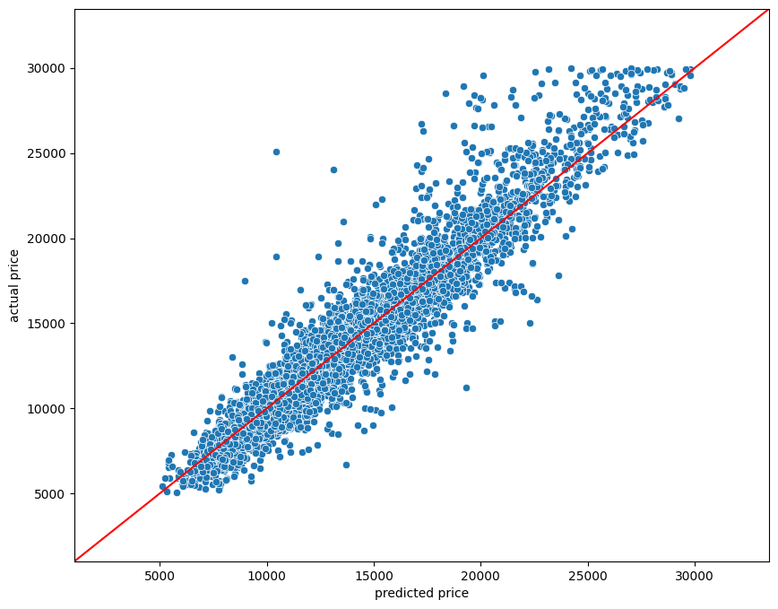

# Housing Price Prediction using XGBoost

Regression modeling of housing prices using gradient boosting (XGBoost).

---

## Project Overview

This project implements a supervised regression pipeline for structured housing market data stored in a SQLite database.

Workflow includes:

- Data extraction from SQLite
- Exploratory Data Analysis (EDA)
- Feature engineering
- Train/validation split
- 5-fold cross-validation
- Hyperparameter tuning (GridSearchCV)
- Model evaluation (MAE, RMSE)
- Feature correlation analysis

---

## Exploratory Data Analysis

### Price per m² Distribution



---

### Price per m² vs Apartment Size



---

### Price per m² vs Floor



---

### Average m² Price by Voivodeship



---


## Spatial Price Distribution (Heat Map)

 Heat map of price per m² based on geographical coordinates.




### Feature Correlation Matrix



---

## Model

Algorithm used:

- XGBoost Regressor (`objective='reg:squarederror'`)

Hyperparameter optimization:

- GridSearchCV
- 5-fold cross-validation
- Negative Mean Squared Error scoring

---

## Model Performance

Validation results:

- MAE: ~374
- RMSE: ~818

Price range: 2500–30000  

The model achieves low relative prediction error for structured tabular data.

---

### Regression Fit Visualization



---

## Key Concepts Demonstrated

- Supervised regression modeling
- Cross-validation
- Hyperparameter optimization
- SQLite data extraction
- Feature correlation analysis
- Data visualization

---

## Technologies

- Python
- Pandas
- NumPy
- scikit-learn
- XGBoost
- SQLite
- Matplotlib
- Seaborn

---

## Running

```bash
pip install -r requirements.txt
jupyter notebook
```
Author: 
Paweł Leszczyński
